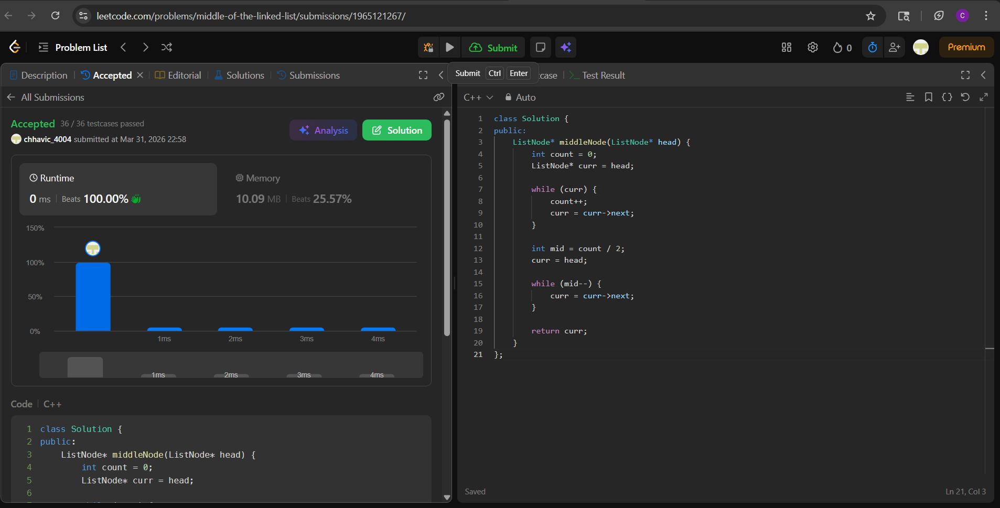

# 876. Middle of the Linked List

**Difficulty:** Easy  
**Topic:** Linked List  
**Author:** Chhavi

---

## Problem

Given the `head` of a singly linked list, return the middle node of the linked list.  
If there are two middle nodes, return the **second** middle node.

---

## My Approach

**Count then Traverse (Two-Pass)**

- **Pass 1:** Traverse the full list to count total nodes.
- **Compute:** `mid = count / 2` — integer division naturally picks the second middle for even-length lists.
- **Pass 2:** Walk exactly `mid` steps from head and return that node.

No extra space needed — just two linear passes.

---

## Code

class Solution {
public:
    ListNode* middleNode(ListNode* head) {
        int count = 0;
        ListNode* curr = head;

        while (curr) {
            count++;
            curr = curr->next;
        }

        int mid = count / 2;
        curr = head;

        while (mid--) {
            curr = curr->next;
        }

        return curr;
    }
};

---

## Complexity

Time Complexity :O(n) 
Space Complexity :O(1) 

---

