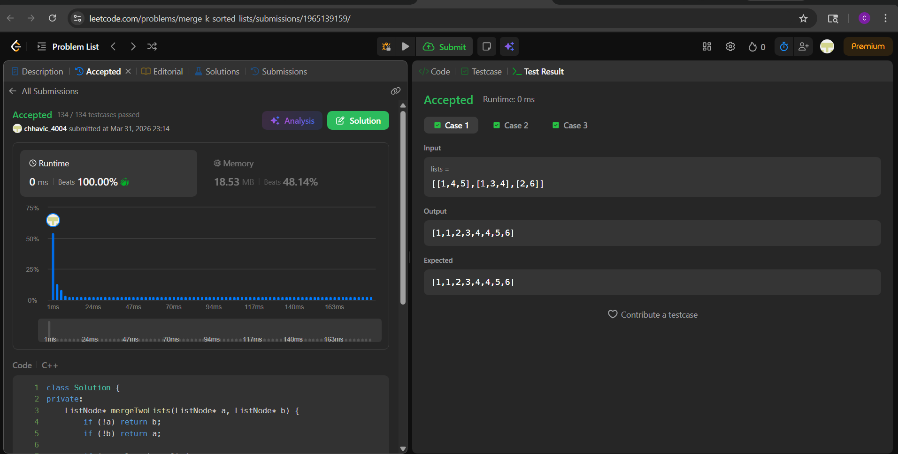

# 23. Merge k Sorted Lists

**Difficulty:** Hard  
**Topic:** Linked List, Divide and Conquer  
**Author:** Chhavi

---

## Problem

You are given an array of `k` linked-lists, each sorted in ascending order. Merge all into one sorted linked list and return it.

---

## My Approach

**Divide and Conquer — Tournament-style Pairwise Merge**

Repeatedly pair up adjacent lists and merge each pair, like a tournament bracket. Each round halves the number of lists until one remains.

```
Round 0:  [L1, L2, L3, L4, L5, L6]
Round 1:  [merge(L1,L2), merge(L3,L4), merge(L5,L6)]
Round 2:  [merge(R1,R2), R3]
Round 3:  [final answer]
```

Base operation: **merge two sorted lists** (recursive two-pointer), applied in-place on the `lists` vector each round.

Each node is touched once per round, and there are O(log k) rounds → **O(N log k)** total.

---

## Code

```cpp
class Solution {
private:
    ListNode* mergeTwoLists(ListNode* a, ListNode* b) {
        if (!a) return b;
        if (!b) return a;

        if (a->val <= b->val) {
            a->next = mergeTwoLists(a->next, b);
            return a;
        } else {
            b->next = mergeTwoLists(b->next, a);
            return b;
        }
    }

public:
    ListNode* mergeKLists(vector<ListNode*>& lists) {
        if (lists.empty()) return nullptr;

        int size = lists.size();

        while (size > 1) {
            int half = size / 2;

            for (int i = 0; i < half; i++) {
                lists[i] = mergeTwoLists(lists[i], lists[size - 1 - i]);
            }

            size = (size + 1) / 2;
        }

        return lists[0];
    }
};
```

> `size = (size + 1) / 2` — the `+1` ensures an odd-count middle list isn't lost between rounds.

---

## Complexity

| | Value |
|---|---|
| Time Complexity | O(N log k) |
| Space Complexity | O(log N) — recursion stack |

---

## Examples

**Example 1:**
```
Input:  [[1,4,5],[1,3,4],[2,6]]
Output: [1,1,2,3,4,4,5,6]
```

**Example 2:**
```
Input:  []
Output: []
```

**Example 3:**
```
Input:  [[]]
Output: []
```

---

## Dry Run

**Input:** `lists = [[1,4,5], [1,3,4], [2,6]]`, size = 3

### Round 1 — half = 1

| i | lists[i] | lists[size-1-i] | Merged result |
|---|----------|-----------------|---------------|
| 0 | [1,4,5]  | [2,6]           | [1,2,4,5,6]   |

`lists = [[1,2,4,5,6], [1,3,4], ...]`, size = (3+1)/2 = **2**

### Round 2 — half = 1

| i | lists[i]    | lists[size-1-i] | Merged result      |
|---|-------------|-----------------|--------------------|
| 0 | [1,2,4,5,6] | [1,3,4]         | [1,1,2,3,4,4,5,6]  |

size = (2+1)/2 = **1** → loop exits

**Output:** `[1,1,2,3,4,4,5,6]` ✓

### Why (size + 1) / 2 works for odd sizes

With size = 3: half = 1, so only `lists[0]` merges with `lists[2]`. `lists[1]` stays untouched.  
size becomes (3+1)/2 = 2, so next round includes `lists[0]` and `lists[1]` — nothing dropped. ✓

---

## Edge Cases

| Case                   | Handling                                              |
|------------------------|-------------------------------------------------------|
| `lists = []`           | `lists.empty()` check → return `nullptr`             |
| `lists = [[]]`         | `mergeTwoLists(nullptr, ...)` returns non-null side   |
| Single list            | size = 1, while loop never runs, returns `lists[0]`   |
| All lists same length  | Pairs evenly every round, no straggler                |

