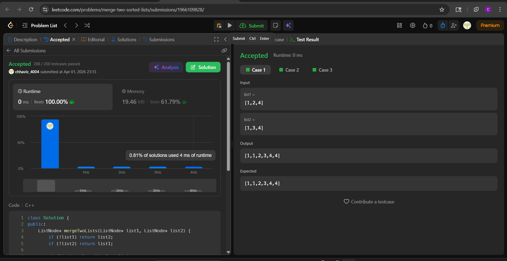

# 21. Merge Two Sorted Lists

**Difficulty:** Easy  
**Topic Tags:** Linked List, Recursion  
**Author:** Chhavi

---

## Problem

You are given the heads of two sorted linked lists `list1` and `list2`.  
Merge the two lists into one sorted list. The list should be made by splicing together the nodes of the first two lists.  
Return the head of the merged linked list.

---

## My Approach

**Recursion**

At each step, compare the heads of both lists and pick the smaller one. That node's `.next` is recursively set to the result of merging the remainder of its list with the other list.

**Recurrence:**
```
merge(l1, l2) = l1 -> merge(l1->next, l2)   if l1->val <= l2->val
              = l2 -> merge(l1, l2->next)     otherwise
```

Base cases: if either list is null, return the other directly.

No dummy node. No loop. The call stack itself builds the merged chain bottom-up.

---

## Code

```cpp
class Solution {
public:
    ListNode* mergeTwoLists(ListNode* list1, ListNode* list2) {
        if (!list1) return list2;
        if (!list2) return list1;

        if (list1->val <= list2->val) {
            list1->next = mergeTwoLists(list1->next, list2);
            return list1;
        } else {
            list2->next = mergeTwoLists(list1, list2->next);
            return list2;
        }
    }
};
```

---

## Complexity

| | Value |
|---|---|
| Time Complexity | O(m + n) |
| Space Complexity | O(m + n) — recursion call stack |

> Key tradeoff vs iterative dummy-node approach: recursive uses O(m+n) stack space instead of O(1).

---

## Examples

**Example 1:**
```
Input:  list1 = [1,2,4], list2 = [1,3,4]
Output: [1,1,2,3,4,4]
```

**Example 2:**
```
Input:  list1 = [], list2 = []
Output: []
```

**Example 3:**
```
Input:  list1 = [], list2 = [0]
Output: [0]
```

---

## Dry Run

**Input:** `list1 = [1,2,4]`, `list2 = [1,3,4]`

| Call | list1 | list2 | Comparison | Action |
|------|-------|-------|------------|--------|
| 1 | 1→2→4 | 1→3→4 | 1 <= 1 → pick l1 | l1(1).next = call(2→4, 1→3→4) |
| 2 | 2→4 | 1→3→4 | 2 > 1 → pick l2 | l2(1).next = call(2→4, 3→4) |
| 3 | 2→4 | 3→4 | 2 <= 3 → pick l1 | l1(2).next = call(4, 3→4) |
| 4 | 4 | 3→4 | 4 > 3 → pick l2 | l2(3).next = call(4, 4) |
| 5 | 4 | 4 | 4 <= 4 → pick l1 | l1(4).next = call(null, 4) |
| 6 | null | 4 | base case | return l2(4) |

**Final chain (built bottom-up):** `1 → 1 → 2 → 3 → 4 → 4` ✓

---

## Edge Cases

| Case | Behavior |
|------|----------|
| Both empty | `!list1` triggers → returns `list2` (null) ✓ |
| One empty | Base case returns the non-null list directly ✓ |
| All equal values | `<=` ensures stability; l1 nodes placed first ✓ |
| One element each | Single recursive comparison + base case ✓ |

