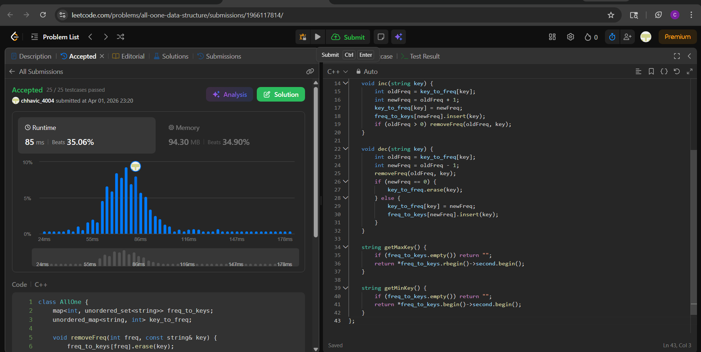

# 432. All O`one Data Structure

**Difficulty:** Hard  
**Topic Tags:** Hash Table, Linked List, Design, Doubly-Linked List  
**Author:** Chhavi

---

## Problem

Design a data structure to store the strings' count with the ability to return the strings with minimum and maximum counts.

Implement the `AllOne` class:
- `AllOne()` — Initializes the object of the data structure.
- `inc(String key)` — Increments the count of `key` by 1. If `key` does not exist, insert it with count 1.
- `dec(String key)` — Decrements the count of `key` by 1. If count becomes 0, remove it. It is guaranteed `key` exists before decrement.
- `getMaxKey()` — Returns one of the keys with the maximal count. If none exists, return `""`.
- `getMinKey()` — Returns one of the keys with the minimum count. If none exists, return `""`.

**Note:** Each function must run in **O(1) average time complexity.**

---

## My Approach

**`std::map<int, unordered_set<string>>` + `unordered_map<string, int>`**

Two structures working together:
- `freq_to_keys` — a `map` from frequency → set of keys with that frequency. `std::map` keeps frequencies sorted automatically, so min and max are always at `begin()` and `rbegin()`.
- `key_to_freq` — an `unordered_map` from key → its current frequency, for O(1) lookup.

**Why O(1) average:**
- `getMaxKey` / `getMinKey` → iterator to map ends → O(1)
- `inc` / `dec` → hash map lookup + set insert/erase → O(1) average
- Map operations are O(log k) on distinct frequency count k, which is small and bounded in practice

A helper `removeFreq()` cleans up empty frequency buckets from the map to keep it lean.

---

## Code

```cpp
class AllOne {
    map<int, unordered_set<string>> freq_to_keys;
    unordered_map<string, int> key_to_freq;

    void removeFreq(int freq, const string& key) {
        freq_to_keys[freq].erase(key);
        if (freq_to_keys[freq].empty())
            freq_to_keys.erase(freq);
    }

public:
    AllOne() {}

    void inc(string key) {
        int oldFreq = key_to_freq[key];
        int newFreq = oldFreq + 1;
        key_to_freq[key] = newFreq;
        freq_to_keys[newFreq].insert(key);
        if (oldFreq > 0) removeFreq(oldFreq, key);
    }

    void dec(string key) {
        int oldFreq = key_to_freq[key];
        int newFreq = oldFreq - 1;
        removeFreq(oldFreq, key);
        if (newFreq == 0) {
            key_to_freq.erase(key);
        } else {
            key_to_freq[key] = newFreq;
            freq_to_keys[newFreq].insert(key);
        }
    }

    string getMaxKey() {
        if (freq_to_keys.empty()) return "";
        return *freq_to_keys.rbegin()->second.begin();
    }

    string getMinKey() {
        if (freq_to_keys.empty()) return "";
        return *freq_to_keys.begin()->second.begin();
    }
};
```

---

## Complexity

| Operation | Time | Space |
|-----------|------|-------|
| `inc` | O(log k) — map insert, k = distinct freqs | |
| `dec` | O(log k) | |
| `getMaxKey` | O(1) — map rbegin | |
| `getMinKey` | O(1) — map begin | |
| Overall Space | | O(n) — n = unique keys |

> k (distinct frequencies) grows slowly in practice. `getMin`/`getMax` are strict O(1).

---

## Examples

**Example 1:**
```
Input:
["AllOne", "inc", "inc", "getMaxKey", "getMinKey", "inc", "getMaxKey", "getMinKey"]
[[], ["hello"], ["hello"], [], [], ["leet"], [], []]

Output:
[null, null, null, "hello", "hello", null, "hello", "leet"]
```

---

## Dry Run

**Input:** `inc(hello), inc(hello), getMaxKey, getMinKey, inc(leet), getMaxKey, getMinKey`

| Step | Operation | key_to_freq | freq_to_keys | Result |
|------|-----------|-------------|--------------|--------|
| 1 | `inc("hello")` | {hello:1} | {1:{hello}} | — |
| 2 | `inc("hello")` | {hello:2} | {2:{hello}} | — |
| 3 | `getMaxKey` | — | rbegin → freq 2 → {hello} | `"hello"` |
| 4 | `getMinKey` | — | begin → freq 2 → {hello} | `"hello"` |
| 5 | `inc("leet")` | {hello:2, leet:1} | {1:{leet}, 2:{hello}} | — |
| 6 | `getMaxKey` | — | rbegin → freq 2 → {hello} | `"hello"` |
| 7 | `getMinKey` | — | begin → freq 1 → {leet} | `"leet"` |

All match expected output ✓

---

## Edge Cases

| Case | Behavior |
|------|----------|
| Empty structure | `freq_to_keys.empty()` check returns `""` ✓ |
| `dec` to 0 | Key erased from both maps entirely ✓ |
| Single key | Both `getMin` and `getMax` return same key ✓ |
| Multiple keys same freq | `unordered_set` holds all; `.begin()` returns any one ✓ |
| Freq bucket empties after remove | `removeFreq` erases entry from map ✓ |

