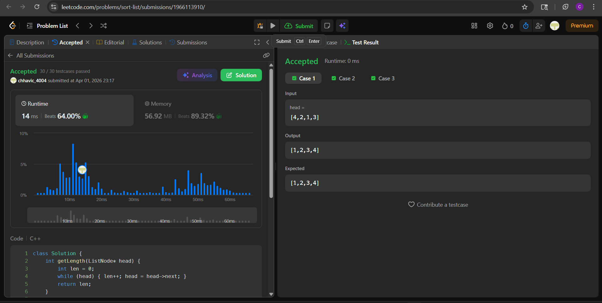

# 148. Sort List

**Difficulty:** Medium  
**Topic Tags:** Linked List, Two Pointers, Divide and Conquer, Sorting, Merge Sort  
**Author:** Chhavi

---

## Problem

Given the `head` of a linked list, return the list after sorting it in ascending order.

**Follow-up:** Can you sort the linked list in `O(n log n)` time and `O(1)` memory?

---

## My Approach

**Bottom-Up Iterative Merge Sort**

Instead of splitting recursively from the top (top-down), start from the bottom — merge adjacent sublists of size 1, then size 2, then size 4... doubling each pass until the whole list is sorted.

**Steps per pass of size `sz`:**
1. Cut sublists of length `sz` from the remaining list using `split()`
2. Merge each left-right pair using `merge()`
3. Attach merged result to a dummy tail
4. Double `sz` and repeat

No recursion → no call stack → **true O(1) space**, directly answering the follow-up.

**Why it works:** After `log n` passes, sublist size exceeds `n`, meaning the whole list is sorted.

---

## Code

```cpp
class Solution {
    int getLength(ListNode* head) {
        int len = 0;
        while (head) { len++; head = head->next; }
        return len;
    }

    ListNode* split(ListNode* head, int sz) {
        for (int i = 1; i < sz && head; i++)
            head = head->next;
        if (!head) return nullptr;
        ListNode* rest = head->next;
        head->next = nullptr;
        return rest;
    }

    pair<ListNode*, ListNode*> merge(ListNode* l1, ListNode* l2) {
        ListNode dummy(0);
        ListNode* curr = &dummy;
        while (l1 && l2) {
            if (l1->val <= l2->val) { curr->next = l1; l1 = l1->next; }
            else                    { curr->next = l2; l2 = l2->next; }
            curr = curr->next;
        }
        curr->next = l1 ? l1 : l2;
        while (curr->next) curr = curr->next;
        return { dummy.next, curr };
    }

public:
    ListNode* sortList(ListNode* head) {
        int n = getLength(head);
        ListNode dummy(0);
        dummy.next = head;

        for (int sz = 1; sz < n; sz <<= 1) {
            ListNode* curr = dummy.next;
            ListNode* tail = &dummy;

            while (curr) {
                ListNode* left  = curr;
                ListNode* right = split(left, sz);
                curr            = split(right, sz);

                auto [merged, end] = merge(left, right);
                tail->next = merged;
                tail = end;
            }
            tail->next = nullptr;
        }
        return dummy.next;
    }
};
```

---

## Complexity

| | Value |
|---|---|
| Time Complexity | O(n log n) — log n passes, each O(n) |
| Space Complexity | O(1) — no recursion, stack-allocated dummy only |

> Directly satisfies the follow-up constraint. Top-down recursive merge sort also achieves O(n log n) but uses O(log n) call stack space.

---

## Examples

**Example 1:**
```
Input:  head = [4,2,1,3]
Output: [1,2,3,4]
```

**Example 2:**
```
Input:  head = [-1,5,3,4,0]
Output: [-1,0,3,4,5]
```

**Example 3:**
```
Input:  head = []
Output: []
```

---

## Dry Run

**Input:** `[4, 2, 1, 3]`, n = 4

**Pass sz=1** (merge adjacent singles):

| left | right | merged |
|------|-------|--------|
| 4 | 2 | 2→4 |
| 1 | 3 | 1→3 |

List after pass: `2→4→1→3`

**Pass sz=2** (merge adjacent pairs):

| left | right | merged |
|------|-------|--------|
| 2→4 | 1→3 | 1→2→3→4 |

List after pass: `1→2→3→4` ✓

`sz=4` now equals `n`, loop ends. Done.

---

## Edge Cases

| Case | Behavior |
|------|----------|
| Empty list | `n=0`, loop never runs, returns null ✓ |
| Single node | `n=1`, `sz=1` not `< n`, returns as-is ✓ |
| Already sorted | Merges confirm order, no unnecessary moves ✓ |
| All same values | `<=` keeps relative order, stable sort ✓ |
| Odd length | `split` returns nullptr for missing right half; `merge` handles null `l2` ✓ |

