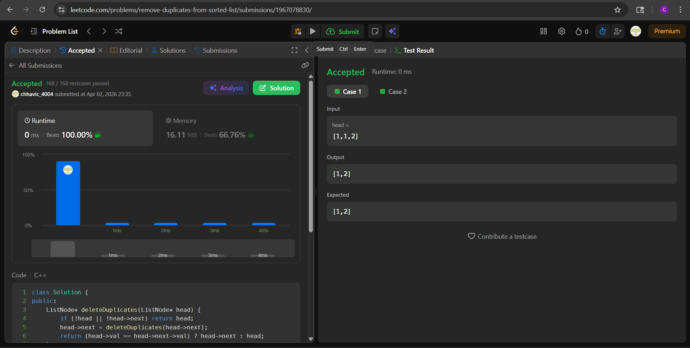

# LC 83. Remove Duplicates from Sorted List

**Difficulty:** Easy
**Topic:** Linked List, Recursion
**Author:** Chhavi

---

## Problem Statement

Given the `head` of a sorted linked list, delete all duplicates such that each element appears only once. Return the linked list sorted as well.

**Constraints:**
- Number of nodes in range `[0, 300]`
- `-100 <= Node.val <= 100`
- List is guaranteed to be sorted in ascending order

---

## Banned Solution

> Standard in-place pointer skipping using a `current` pointer that skips `current->next` when a duplicate is found.

---

## Approach — Recursion (Post-order Decision)

### Intuition

Instead of scanning forward and skipping nodes imperatively, we solve the subproblem first:

> "Clean the list starting from `head->next`, then decide if `head` itself belongs."

After the recursive call returns, `head->next` is already a fully deduplicated list. At that point, we just check: does `head` have the same value as `head->next`? If yes, discard `head` and return `head->next`. If no, keep `head`.

This is a **post-order** decision — act after the recursion returns, not before.

### Key Insight

Because the list is **sorted**, duplicates are always adjacent. So after deduplication of the suffix, `head->next` is the first unique node after `head`. One comparison is enough.

---

## Code

```cpp
class Solution {
public:
    ListNode* deleteDuplicates(ListNode* head) {
        if (!head || !head->next) return head;
        head->next = deleteDuplicates(head->next);
        return (head->val == head->next->val) ? head->next : head;
    }
};
```

---

## Dry Run

### Example 1: `[1, 1, 2]`

| Call | head.val | head->next after recursion | head->next->val | Decision | Returns |
|------|----------|---------------------------|-----------------|----------|---------|
| 3rd  | 2        | null                      | —               | base case | node(2) |
| 2nd  | 1        | node(2)                   | 2               | 1 ≠ 2 → keep head | node(1→2) |
| 1st  | 1        | node(1→2)                 | 1               | 1 == 1 → skip head | node(1→2) |

**Output:** `[1, 2]` ✓

---

### Example 2: `[1, 1, 2, 3, 3]`

| Call | head.val | head->next after recursion | head->next->val | Decision | Returns |
|------|----------|---------------------------|-----------------|----------|---------|
| 5th  | 3        | null                      | —               | base case | node(3) |
| 4th  | 3        | node(3)                   | 3               | 3 == 3 → skip head | node(3) |
| 3rd  | 2        | node(3)                   | 3               | 2 ≠ 3 → keep head | node(2→3) |
| 2nd  | 1        | node(1→2→3)               | 1               | 1 == 1 → skip head | node(1→2→3) |
| 1st  | 1        | node(1→2→3)               | 1               | 1 == 1 → skip head | node(1→2→3) |

**Output:** `[1, 2, 3]` ✓

---

## Complexity Analysis

| | Complexity | Reason |
|---|---|---|
| **Time** | O(n) | Each node visited exactly once |
| **Space** | O(n) | Recursive call stack — one frame per node |

---

## Edge Cases

| Case | Input | Expected Output | Handled By |
|------|-------|-----------------|------------|
| Empty list | `[]` | `[]` | `!head` base case |
| Single node | `[1]` | `[1]` | `!head->next` base case |
| All duplicates | `[2, 2, 2]` | `[2]` | Recursive skip until one remains |
| No duplicates | `[1, 2, 3]` | `[1, 2, 3]` | All comparisons fail → no node skipped |
| Two elements, duplicate | `[5, 5]` | `[5]` | 2nd call returns node(5), 1st skips itself |

---

## Difference from Banned Solution

| Aspect | Banned (Iterative) | This (Recursive) |
|---|---|---|
| Direction | Forward scan, skip next | Solve suffix first, decide on head |
| Pointer mutation | `current->next = current->next->next` | `head->next = result of recursion` |
| Space | O(1) | O(n) stack |
| Style | Imperative | Declarative / post-order |


