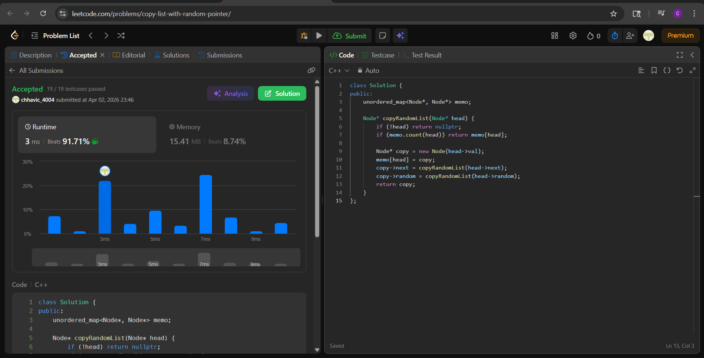

# LC 138. Copy List with Random Pointer

**Difficulty:** Medium
**Topic:** Linked List, Hash Map, Recursion, Memoization
**Author:** Chhavi

---

## Problem Statement

A linked list of length `n` is given such that each node contains an additional `random` pointer, which could point to any node in the list, or `null`. Construct a **deep copy** of the list — brand new nodes where both `next` and `random` point only to nodes within the copied list, never back to the original.

**Constraints:**
- `0 <= n <= 1000`
- `-10^4 <= Node.val <= 10^4`
- `Node.random` is `null` or points to some node in the linked list

---

## Banned Solution

> Two-pass hashmap: first pass creates all copies and maps `original → copy`, second pass wires `next` and `random` using the map.

---

## Approach — Recursion + Memoization

### Intuition

The challenge with deep copying this list is the `random` pointer — it can point to any node, including ones not yet created. The banned solution handles this with two explicit passes. 

Recursion handles it naturally: when we recurse into `head->random`, we either:
- **Haven't seen it yet** → create it, memoize, recurse further
- **Already created it** → return from memo immediately

The memo map serves the same role as the banned solution's map, but the creation and wiring happen **in a single recursive traversal** rather than two explicit loops. The memo also prevents infinite loops if `random` pointers form cycles back to already-visited nodes.

### Key Insight

Store the copy in `memo[head]` **before** recursing into `next` and `random`. This is critical — if any `random` pointer down the chain points back to `head`, the recursive call will find it in memo and return immediately instead of looping forever.

### Steps

1. Base case: if `head == null`, return `null`.
2. If `head` already in memo, return `memo[head]` — node already created.
3. Create `copy = new Node(head->val)`.
4. Store `memo[head] = copy` immediately.
5. Recurse: `copy->next = copyRandomList(head->next)`.
6. Recurse: `copy->random = copyRandomList(head->random)`.
7. Return `copy`.

---

## Code

```cpp
class Solution {
public:
    unordered_map<Node*, Node*> memo;

    Node* copyRandomList(Node* head) {
        if (!head) return nullptr;
        if (memo.count(head)) return memo[head];

        Node* copy = new Node(head->val);
        memo[head] = copy;
        copy->next = copyRandomList(head->next);
        copy->random = copyRandomList(head->random);
        return copy;
    }
};
```

---

## Dry Run

### Example 1: `[[7,null],[13,0],[11,4],[10,2],[1,0]]`

Nodes: `A(7) → B(13) → C(11) → D(10) → E(1)`

Random pointers:
- A.random = null
- B.random = A
- C.random = E
- D.random = C
- E.random = A

**Recursive call trace:**

| Call | head | memo hit? | Action |
|------|------|-----------|--------|
| 1 | A(7) | No | Create A', store memo[A]=A', recurse next→B, random→null |
| 2 | B(13) | No | Create B', store memo[B]=B', recurse next→C, random→A |
| 3 | C(11) | No | Create C', store memo[C]=C', recurse next→D, random→E |
| 4 | D(10) | No | Create D', store memo[D]=D', recurse next→E, random→C |
| 5 | E(1) | No | Create E', store memo[E]=E', recurse next→null, random→A |
| 6 | null | — | return null (E'.next = null) |
| 7 | A(7) | **Yes** | return A' (E'.random = A') |
| — | back at D | — | D'.random = C' (already created at step 3) |
| — | back at C | — | C'.random = E' (already created at step 5) |
| — | back at B | — | B'.random = A' (memo hit) |
| — | back at A | — | A'.random = null |

**Output:** `[[7,null],[13,0],[11,4],[10,2],[1,0]]` ✓

---

### Example 2: `[[1,1],[2,1]]`

Nodes: `A(1) → B(2)`
- A.random = B
- B.random = B (self-loop)

| Call | head | memo hit? | Action |
|------|------|-----------|--------|
| 1 | A(1) | No | Create A', memo[A]=A', recurse next→B, random→B |
| 2 | B(2) | No | Create B', memo[B]=B', recurse next→null, random→B |
| 3 | null | — | return null (B'.next = null) |
| 4 | B(2) | **Yes** | return B' (B'.random = B') |
| — | back at A | — | A'.random = B' (memo hit) |

**Output:** `[[1,1],[2,1]]` ✓

---

## Complexity Analysis

| | Complexity | Reason |
|---|---|---|
| **Time** | O(n) | Each node visited exactly once; memo hits return immediately |
| **Space** | O(n) | memo map stores n entries + O(n) recursive call stack |

---

## Edge Cases

| Case | Input | Expected Output | Handled By |
|------|-------|-----------------|------------|
| Empty list | `null` | `null` | `!head` base case |
| Single node, random = null | `[[3,null]]` | `[[3,null]]` | Recurse next→null, random→null |
| Single node, random = self | `[[1,0]]` | `[[1,0]]` | memo hit on random call returns same copy |
| All randoms point to head | `[[1,0],[2,0],[3,0]]` | same structure | memo hit on every random after first visit to head |
| Random points to unvisited node | any forward random | correct copy returned | recursion creates it on demand |
| Random creates back-reference cycle | B.random → A (already visited) | correct | memo[A] already set before recursing into B |

---

## Difference from Banned Solution

| Aspect | Banned (Two-pass hashmap) | This (Recursive memo) |
|---|---|---|
| Passes | Explicit pass 1: create all nodes; pass 2: wire next + random | Single recursive traversal — create and wire on demand |
| Map role | Lookup during wiring pass | Prevent duplicate creation + cycle guard |
| Order of creation | All nodes created before any wiring | Node created just before its children are recursed |
| Cycle handling | Not needed (all nodes exist before wiring) | Critical — memo[head] set before recursing to handle back-references |
| Code structure | Two separate while loops | Single recursive function |
| Space | O(n) map | O(n) map + O(n) stack |

