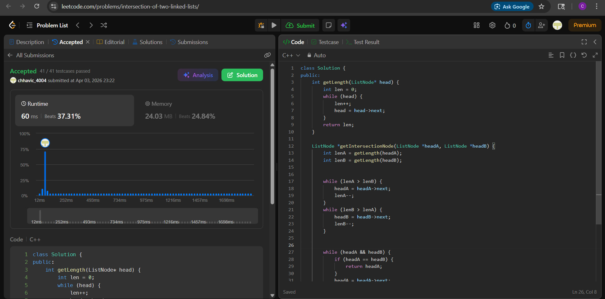

# LC 160. Intersection of Two Linked Lists

**Difficulty:** Easy  
**Topic:** Linked List, Two Pointers  
**Author:** Chhavi

---

## Problem Statement

Given the heads of two singly linked lists `headA` and `headB`, return the node at which the two lists intersect. If the two linked lists have no intersection at all, return `null`.

The intersection is based on **node reference**, not value. That means two nodes are considered the same only if they point to the same memory location.

**Constraints:**
- `1 <= m, n <= 3 * 10^4`
- `1 <= Node.val <= 10^5`
- `0 <= skipA <= m`
- `0 <= skipB <= n`
- No cycles exist in either list

---

## Banned Solution

> Two-pointer switching technique where pointers jump to the other list after reaching the end.

---

## Approach — Length Difference Alignment

### Intuition

If two linked lists intersect, the portion after the intersection node is shared. This means both lists have the same number of nodes from the intersection point to the end.

Before that, their lengths may differ. So we align both lists such that they have equal remaining nodes to traverse.

### Key Insight

Advance the pointer of the longer list by the difference in lengths. After alignment, both pointers will reach the intersection at the same time if it exists.

### Steps

1. Compute lengths of both lists.
2. Find difference `|lenA - lenB|`.
3. Move pointer of longer list ahead by that difference.
4. Traverse both together:
   - If nodes match → return node.
5. If no match → return `null`.

---

## Code

```cpp
class Solution {
public:
    int getLength(ListNode* head) {
        int len = 0;
        while (head) {
            len++;
            head = head->next;
        }
        return len;
    }

    ListNode *getIntersectionNode(ListNode *headA, ListNode *headB) {
        int lenA = getLength(headA);
        int lenB = getLength(headB);

        while (lenA > lenB) {
            headA = headA->next;
            lenA--;
        }
        while (lenB > lenA) {
            headB = headB->next;
            lenB--;
        }

        while (headA && headB) {
            if (headA == headB) return headA;
            headA = headA->next;
            headB = headB->next;
        }

        return nullptr;
    }
};


