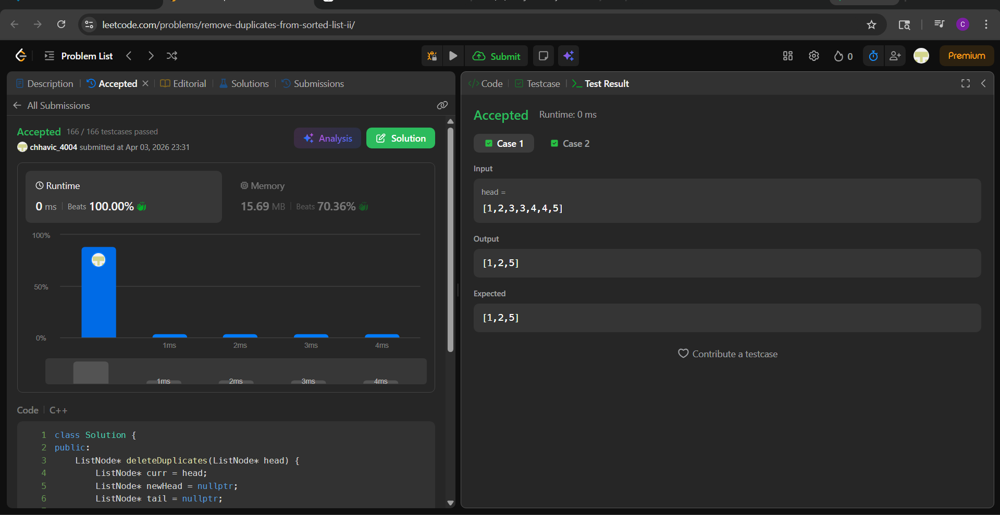

# LC 82. Remove Duplicates from Sorted List II

**Difficulty:** Medium  
**Topic:** Linked List  
**Author:** Chhavi

---

## Problem Statement

Given the head of a sorted linked list, delete all nodes that have duplicate numbers, leaving only distinct numbers from the original list. Return the linked list sorted as well.

**Constraints:**
- `0 <= n <= 300`
- `-100 <= Node.val <= 100`
- The list is sorted in ascending order

---

## Banned Solution

> Using a dummy node with a nested loop to skip duplicates directly by reconnecting pointers.

---

## Approach — Skip Duplicates Using Two Pointers

### Intuition

Since the list is sorted, duplicates always appear **contiguously**.

So instead of removing duplicates one by one, we:
- Detect a block of duplicates
- Skip the entire block at once
- Only keep nodes that appear exactly once

### Key Insight

A node should be included in the final list **only if it does NOT have the same value as its next node**.

---

### Steps

1. Use two pointers:
   - `curr` → traverses the list
   - `tail` → builds the result list
2. For each node:
   - If it is the start of duplicates → skip all nodes with that value
   - Otherwise → attach it to result
3. Continue until end

---

## Code

```cpp
class Solution {
public:
    ListNode* deleteDuplicates(ListNode* head) {
        ListNode* curr = head;
        ListNode* newHead = nullptr;
        ListNode* tail = nullptr;

        while (curr) {
            // check if current node is duplicate
            if (curr->next && curr->val == curr->next->val) {
                int val = curr->val;
                // skip all duplicates
                while (curr && curr->val == val) {
                    curr = curr->next;
                }
            } else {
                // unique node
                if (!newHead) {
                    newHead = curr;
                    tail = curr;
                } else {
                    tail->next = curr;
                    tail = tail->next;
                }
                curr = curr->next;
                tail->next = nullptr; // important to break old links
            }
        }

        return newHead;
    }
};

