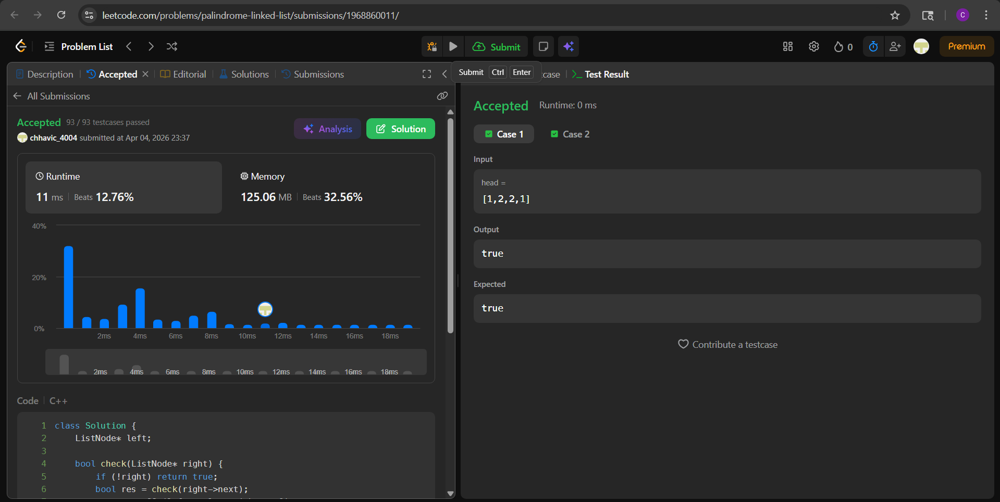

# LC 234. Palindrome Linked List

**Difficulty:** Easy
**Topic:** Linked List, Recursion, Two Pointers
**Author:** Chhavi

---

## Problem Statement

Given the `head` of a singly linked list, return `true` if it is a palindrome or `false` otherwise.

**Constraints:**
- Number of nodes in range `[1, 10^5]`
- `0 <= Node.val <= 9`

---


## Approach — Recursive Call Stack Comparison

### Intuition

Recursion naturally unwinds from the **tail back to the head** — the call stack gives us right-to-left traversal for free. If we maintain a global `left` pointer starting at the head, and compare it against the `right` pointer as recursion unwinds, we get a two-pointer palindrome check without touching the list at all.

As each recursive call returns, `right` moves one step backward (tail → head), and `left` is manually advanced one step forward. Any mismatch at any level short-circuits to `false`.

### Steps

1. Set `left = head` globally.
2. Recurse to the end of the list via `check(right->next)`.
3. On the way back (unwind), compare `left->val == right->val`.
4. Advance `left = left->next` after each comparison.
5. If all pairs match, return `true`.

### Key Order of Operations Inside `check()`

```
check(right->next)                   ← go all the way to null first
res && (left->val == right->val)     ← compare on unwind (right is at tail)
left = left->next                    ← advance left forward
```

This ordering ensures `right` starts at the tail and walks backward while `left` walks forward — meeting in the middle.

---

## Code

```cpp
class Solution {
    ListNode* left;

    bool check(ListNode* right) {
        if (!right) return true;
        bool res = check(right->next);
        res = res && (left->val == right->val);
        left = left->next;
        return res;
    }

public:
    bool isPalindrome(ListNode* head) {
        left = head;
        return check(head);
    }
};
```

---

## Dry Run

### Example 1: `head = [1, 2, 3, 2, 1]`

Recursion goes all the way to `null`, then unwinds:

| Unwind Step | right (val) | left (val) | Match? | left advances to |
|-------------|-------------|------------|--------|-----------------|
| 1st         | 1 (tail)    | 1 (head)   | ✅ yes | node(2)         |
| 2nd         | 2           | 2          | ✅ yes | node(3)         |
| 3rd         | 3 (mid)     | 3          | ✅ yes | node(2)         |

> At step 3, `right` and `left` meet at the center node. Remaining unwinds are already covered by symmetry.

**Output:** `true` ✓

---

### Example 2: `head = [1, 2]`

| Unwind Step | right (val) | left (val) | Match? |
|-------------|-------------|------------|--------|
| 1st         | 2 (tail)    | 1 (head)   | ❌ no  |

Short-circuits immediately, no further comparisons.

**Output:** `false` ✓

---

## Complexity Analysis

| | Complexity | Reason |
|---|---|---|
| **Time** | O(n) | Every node visited exactly once via recursion |
| **Space** | O(n) | Call stack depth equals length of list |

> **Note on Follow-up:** Achieving true `O(1)` space requires mutating the list (in-place reversal). This recursive approach trades space for structural purity — no mutation, no explicit stack, no extra array.

---

## Edge Cases

| Case | Input | Expected Output | Handled By |
|------|-------|-----------------|------------|
| Single node | `[1]` | `true` | `!right` base case returns true immediately |
| Two nodes same | `[1, 1]` | `true` | One comparison on unwind matches |
| Two nodes diff | `[1, 2]` | `false` | One comparison on unwind mismatches |
| All same values | `[3, 3, 3, 3]` | `true` | All unwind comparisons match |
| Even length | `[1, 2, 2, 1]` | `true` | left and right meet symmetrically from both ends |
| Odd length | `[1, 2, 3, 2, 1]` | `true` | Center node compared to itself → always matches |

---


