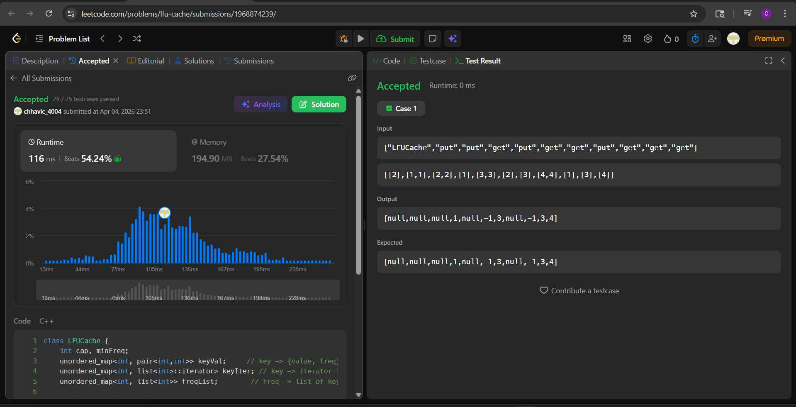

# LC 460. LFU Cache

**Difficulty:** Hard
**Topic:** Hash Table, Linked List, Design, Doubly-Linked List
**Author:** Chhavi

---

## Problem Statement

Design and implement a data structure for a **Least Frequently Used (LFU)** cache.

Implement the `LFUCache` class:
- `LFUCache(int capacity)` — Initializes with given capacity.
- `int get(int key)` — Returns value if key exists, else `-1`.
- `void put(int key, int value)` — Inserts or updates key. If at capacity, evicts the LFU key. Ties broken by LRU (least recently used among same frequency).

Both `get` and `put` must run in **O(1) average time**.

**Constraints:**
- `1 <= capacity <= 10^4`
- `0 <= key <= 10^5`
- `0 <= value <= 10^9`
- At most `2 * 10^5` calls to `get` and `put`

---

## Approach — Three Hash Maps + `std::list` with Iterator Tracking

### Intuition

The core challenge: at eviction time, we need to instantly know which key has the smallest frequency, and among ties, which was used least recently. Maintaining this in O(1) requires careful structure.

Three maps divide the responsibilities cleanly:

| Map | Key | Value | Purpose |
|-----|-----|-------|---------|
| `keyVal` | key | `{value, freq}` | O(1) value and frequency lookup |
| `keyIter` | key | iterator into its freq-bucket | O(1) location inside the bucket for erase |
| `freqList` | freq | `list<int>` of keys | Ordered bucket: front = most recent, back = LRU |

One integer `minFreq` tracks which bucket to evict from.

**Why `std::list` + stored iterators?**
- `list::erase(iterator)` is **O(1)** — no searching, no shifting.
- `list::push_front` is **O(1)** — most recently used always goes to front.
- Eviction is always `freqList[minFreq].back()` — the LRU among minimum frequency keys.
- `keyIter` stores exactly where each key sits → erase in O(1) without scanning.

### The `promote(key)` Helper

Both `get` and `put` (on existing keys) need the same frequency-upgrade logic. Extracted into one helper:

1. Read current `freq` from `keyVal[key]`.
2. Erase key from `freqList[freq]` using stored iterator.
3. If `freqList[freq]` is now empty → erase the bucket. If `freq == minFreq` → `minFreq++`.
4. Push key to front of `freqList[freq+1]`.
5. Store new iterator in `keyIter[key]`.
6. Increment `keyVal[key].second`.

### `get(key)`

1. Key not found → return `-1`.
2. Call `promote(key)`.
3. Return `keyVal[key].first`.

### `put(key, value)`

- **Key exists** → update value in `keyVal`, call `promote(key)`.
- **Key new:**
  1. If at capacity → evict `freqList[minFreq].back()`, clean up all three maps.
  2. Insert: `keyVal[key] = {value, 1}`, push to front of `freqList[1]`, store iterator.
  3. Set `minFreq = 1`.

---

## Code

```cpp
class LFUCache {
    int cap, minFreq;
    unordered_map<int, pair<int,int>> keyVal;
    unordered_map<int, list<int>::iterator> keyIter;
    unordered_map<int, list<int>> freqList;

    void promote(int key) {
        int freq = keyVal[key].second;
        freqList[freq].erase(keyIter[key]);
        if (freqList[freq].empty()) {
            freqList.erase(freq);
            if (minFreq == freq) minFreq++;
        }
        freqList[freq + 1].push_front(key);
        keyIter[key] = freqList[freq + 1].begin();
        keyVal[key].second++;
    }

public:
    LFUCache(int capacity) : cap(capacity), minFreq(0) {}

    int get(int key) {
        if (!keyVal.count(key)) return -1;
        promote(key);
        return keyVal[key].first;
    }

    void put(int key, int value) {
        if (cap == 0) return;
        if (keyVal.count(key)) {
            keyVal[key].first = value;
            promote(key);
        } else {
            if ((int)keyVal.size() == cap) {
                int evict = freqList[minFreq].back();
                freqList[minFreq].pop_back();
                if (freqList[minFreq].empty()) freqList.erase(minFreq);
                keyVal.erase(evict);
                keyIter.erase(evict);
            }
            keyVal[key] = {value, 1};
            freqList[1].push_front(key);
            keyIter[key] = freqList[1].begin();
            minFreq = 1;
        }
    }
};
```

---

## Dry Run

### Input: `capacity = 2`

| Operation | Action | freqList state | minFreq | Output |
|-----------|--------|----------------|---------|--------|
| `put(1,1)` | Insert key 1, freq=1 | `f1:[1]` | 1 | — |
| `put(2,2)` | Insert key 2, freq=1 | `f1:[2,1]` | 1 | — |
| `get(1)` | Promote 1: f1→f2 | `f1:[2]` `f2:[1]` | 1 | 1 |
| `put(3,3)` | Full → evict back of f1 = key 2. Insert 3 at f1 | `f1:[3]` `f2:[1]` | 1 | — |
| `get(2)` | Key 2 not in map | — | — | -1 |
| `get(3)` | Promote 3: f1→f2 | `f1:[]` `f2:[3,1]` | 2 | 3 |
| `put(4,4)` | Full → evict back of f2 = key 1. Insert 4 at f1 | `f1:[4]` `f2:[3]` | 1 | — |
| `get(1)` | Key 1 not in map | — | — | -1 |
| `get(3)` | Promote 3: f2→f3 | `f1:[4]` `f3:[3]` | 1 | 3 |
| `get(4)` | Promote 4: f1→f2 | `f2:[4]` `f3:[3]` | 2 | 4 |

**Final output:** `[null, null, null, 1, null, -1, 3, null, -1, 3, 4]` ✓

---

## Complexity Analysis

| | Complexity | Reason |
|---|---|---|
| **Time** | O(1) avg | `list::erase(iterator)` O(1), `push_front` O(1), all map ops O(1) avg |
| **Space** | O(capacity) | At most `capacity` keys across all three maps |

---

## Edge Cases

| Case | Input | Expected | Handled By |
|------|-------|----------|------------|
| Capacity 0 | `put(1,1)` | no-op | `if (cap == 0) return` |
| Get missing key | `get(99)` | -1 | `!keyVal.count(key)` check |
| Update existing key | `put(1,1)` then `put(1,9)` | `get(1)=9` | `keyVal.count(key)` branch in `put` |
| Tie on freq → LRU evicted | Two keys at f1, evict older | correct key gone | `freqList[minFreq].back()` = LRU end |
| minFreq update on promote | Last key at minFreq promoted | minFreq++ | `if (minFreq == freq) minFreq++` inside promote |
| Single capacity | `capacity=1, put(1,1), put(2,2)` | `get(1)=-1` | Evict triggered, key 1 removed |

---


---

 