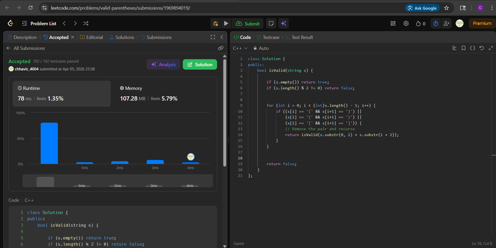

# Day 15 — LC 20. Valid Parentheses (Easy)

## Problem
Given a string `s` containing just the characters `'('`, `')'`, `'{'`, `'}'`, `'['` and `']'`, determine if the input string is valid.

A string is valid if:
1. Open brackets must be closed by the same type of brackets.
2. Open brackets must be closed in the correct order.
3. Every close bracket has a corresponding open bracket of the same type.

---

## Approach — Recursive Stripping

Find the first adjacent valid pair `()`, `[]`, or `{}` in the string, remove it, and recurse on the remaining string. If the string becomes empty, it's valid. If no valid pair is found but the string is non-empty, it's invalid.

---

## Code (C++)

```cpp
class Solution {
public:
    bool isValid(string s) {
        if (s.empty()) return true;
        if (s.length() % 2 != 0) return false;

        for (int i = 0; i < (int)s.length() - 1; i++) {
            if ((s[i] == '(' && s[i+1] == ')') ||
                (s[i] == '{' && s[i+1] == '}') ||
                (s[i] == '[' && s[i+1] == ']')) {
                return isValid(s.substr(0, i) + s.substr(i + 2));
            }
        }

        return false;
    }
};
```

---

## Dry Run

**Input:** `"([])"`

```
isValid("([])")
  → found "[]" at i=1 → remove → isValid("()")
      → found "()" at i=0 → remove → isValid("")
          → empty → return true ✓
```

**Input:** `"([)]"`

```
isValid("([)]")
  → scan: "(["? No. "[)"? No. ")}"? No.
  → no adjacent valid pair found
  → return false ✓
```

---

## Complexity

| | Value |
|---|---|
| Time | O(n²) — O(n) scan per level, up to n/2 recursive calls |
| Space | O(n²) — substr allocations + O(n/2) call stack depth |

---

## Edge Cases

| Input | Output | Reason |
|---|---|---|
| `""` | `true` | empty string is valid |
| `"("` | `false` | odd length, caught early |
| `"(("` | `false` | no adjacent pair ever found |
| `"([]{})"` | `true` | innermost pairs stripped first |
| `"([)]"` | `false` | no adjacent valid pair exists |

---


