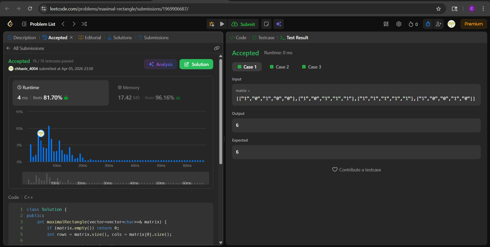

# Day 17 — LC 85. Maximal Rectangle (Hard)

## Problem
Given a `rows x cols` binary matrix filled with `'0'`s and `'1'`s, find the largest rectangle containing only `'1'`s and return its area.

---

## Approach — DP with Left/Right/Height Arrays

For each row, maintain three 1D arrays across rows:
- `height[j]` — consecutive 1s directly above including current cell
- `left[j]` — leftmost column the rectangle at this cell can extend to
- `right[j]` — rightmost column (exclusive) it can extend to

Area at each cell = `(right[j] - left[j]) * height[j]`. All three arrays are updated in O(cols) per row using DP, so no stack is needed.

---

## Code (C++)

```cpp
class Solution {
public:
    int maximalRectangle(vector<vector<char>>& matrix) {
        if (matrix.empty()) return 0;
        int rows = matrix.size(), cols = matrix[0].size();

        vector<int> height(cols, 0);
        vector<int> left(cols, 0);
        vector<int> right(cols, cols);

        int maxArea = 0;

        for (int i = 0; i < rows; i++) {
            // Update height
            for (int j = 0; j < cols; j++)
                height[j] = matrix[i][j] == '1' ? height[j] + 1 : 0;

            // Update left boundary
            int curLeft = 0;
            for (int j = 0; j < cols; j++) {
                if (matrix[i][j] == '1')
                    left[j] = max(left[j], curLeft);
                else {
                    left[j] = 0;
                    curLeft = j + 1;
                }
            }

            // Update right boundary
            int curRight = cols;
            for (int j = cols - 1; j >= 0; j--) {
                if (matrix[i][j] == '1')
                    right[j] = min(right[j], curRight);
                else {
                    right[j] = cols;
                    curRight = j;
                }
            }

            // Compute max area
            for (int j = 0; j < cols; j++)
                maxArea = max(maxArea, (right[j] - left[j]) * height[j]);
        }

        return maxArea;
    }
};
```

---

## Dry Run

**Input:**
```
1 0 1 0 0
1 0 1 1 1
1 1 1 1 1
1 0 0 1 0
```

After row 2 (0-indexed):
```
height = [3, 1, 3, 3, 3]
left   = [0, 1, 2, 2, 2]
right  = [1, 5, 5, 5, 5]
```

Areas at row 2:
```
j=0: (1-0)*3 = 3
j=1: (5-1)*1 = 4
j=2: (5-2)*3 = 9  → capped by left boundary from earlier rows
j=3: (5-2)*3 = 9
j=4: (5-2)*3 = 9
```

The `left[]` and `right[]` arrays carry the tightest boundary seen across all rows above, ensuring only valid rectangles are counted. Final answer = **6**.

---

## Complexity

| | Value |
|---|---|
| Time | O(rows × cols) — 4 passes per row |
| Space | O(cols) — three 1D arrays, no matrix copy |

---

## Edge Cases

| Input | Output | Reason |
|---|---|---|
| All 0s | 0 | height stays 0 everywhere |
| All 1s | rows × cols | left=0, right=cols for all cells |
| Single row | max run of 1s | height=1, area = run length |
| Single col | count of 1s | width=1, height grows per row |

---

