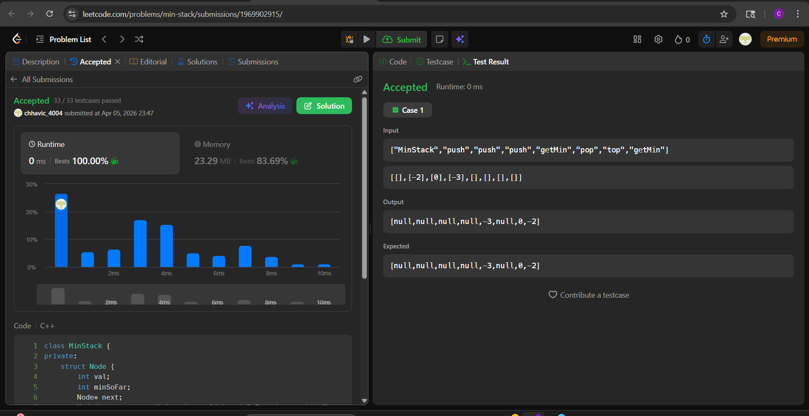

# Day 16 — LC 155. Min Stack (Medium)

## Problem
Design a stack that supports push, pop, top, and retrieving the minimum element in constant time.

Implement the `MinStack` class:
- `MinStack()` initializes the stack object.
- `void push(int val)` pushes the element `val` onto the stack.
- `void pop()` removes the element on the top of the stack.
- `int top()` gets the top element of the stack.
- `int getMin()` retrieves the minimum element in the stack.

All operations must run in **O(1)** time.

---

## Approach — Linked List of Nodes

Each node in the linked list stores its own value AND the minimum seen so far from that node downward. `getMin()` simply reads `head->minSoFar` — no scanning, no second structure.

---

## Code (C++)

```cpp
class MinStack {
private:
    struct Node {
        int val;
        int minSoFar;
        Node* next;
        Node(int v, int m, Node* n) : val(v), minSoFar(m), next(n) {}
    };
    Node* head;

public:
    MinStack() : head(nullptr) {}

    void push(int val) {
        int newMin = (head == nullptr) ? val : min(val, head->minSoFar);
        head = new Node(val, newMin, head);
    }

    void pop() {
        Node* temp = head;
        head = head->next;
        delete temp;
    }

    int top() {
        return head->val;
    }

    int getMin() {
        return head->minSoFar;
    }
};
```

---

## Dry Run

**Input:** `push(-2), push(0), push(-3), getMin(), pop(), top(), getMin()`

```
push(-2) → head: [-2 | min=-2] → null
push(0)  → head: [0  | min=-2] → [-2 | min=-2] → null
push(-3) → head: [-3 | min=-3] → [0  | min=-2] → [-2 | min=-2] → null

getMin() → head->minSoFar = -3 ✓

pop()    → head: [0  | min=-2] → [-2 | min=-2] → null

top()    → head->val = 0 ✓
getMin() → head->minSoFar = -2 ✓
```

---

## Complexity

| Operation | Time | Space |
|---|---|---|
| push | O(1) | O(1) per node |
| pop | O(1) | — |
| top | O(1) | — |
| getMin | O(1) | — |
| Overall space | — | O(n) |

---

## Edge Cases

| Scenario | Handled? |
|---|---|
| Push duplicate minimums | ✓ — each node stores its own min independently |
| Pop the current minimum | ✓ — previous node still has correct min for its level |
| Single element stack | ✓ — `minSoFar = val` on first push |
| Negative values | ✓ — `min()` works on all int ranges |

---

