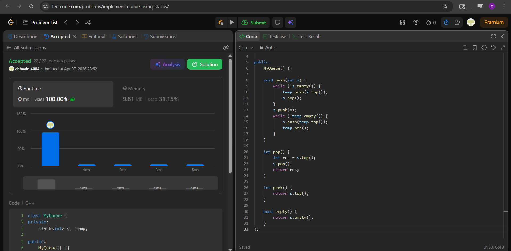

# LC 232 - Implement Queue using Stacks
**Chhavi Choudhary | Day 16 | Easy**

---

## Approach

**Eager Transfer using Two Stacks**

Maintain one "main" stack `s` such that the **queue front is always at the top of `s`**. The second stack `temp` acts only as a temporary reversal buffer during `push` — it is empty at all other times.

**On `push(x)`:**
1. Pour all elements from `s` into `temp` (reversing order).
2. Push `x` onto `s` (now at the bottom, i.e., back of queue).
3. Pour everything from `temp` back into `s` (restoring order, with `x` at the bottom).

After this, `s.top()` always holds the front of the queue.

**On `pop()` / `peek()`:** Simply operate on `s.top()` — O(1).

**Complexity:**
- `push` → O(n)
- `pop`, `peek`, `empty` → O(1)

---

## Code

```cpp
class MyQueue {
private:
    stack<int> s, temp;

public:
    MyQueue() {}

    void push(int x) {
        while (!s.empty()) {
            temp.push(s.top());
            s.pop();
        }
        s.push(x);
        while (!temp.empty()) {
            s.push(temp.top());
            temp.pop();
        }
    }

    int pop() {
        int res = s.top();
        s.pop();
        return res;
    }

    int peek() {
        return s.top();
    }

    bool empty() {
        return s.empty();
    }
};
```

---

## Dry Run

**Operations:** `push(1)` → `push(2)` → `peek()` → `pop()` → `empty()`

**push(1):**
- `s` is empty, so skip first while.
- Push 1 → `s = [1]` (top = 1)
- `temp` is empty, skip second while.
- `s = [1]`, front = 1 ✓

**push(2):**
- Pour `s` into `temp`: `temp = [1]`, `s = []`
- Push 2 → `s = [2]`
- Pour `temp` back: `s = [2, 1]` (top = 1)
- Front of queue = `s.top()` = 1 ✓

**peek():**
- Return `s.top()` = **1** ✓

**pop():**
- `res = s.top()` = 1, `s.pop()` → `s = [2]`
- Return **1** ✓

**empty():**
- `s.empty()` = false → return **false** ✓

---

## Complexity Analysis

| Operation | Time | Space |
|-----------|------|-------|
| `push`    | O(n) | O(n)  |
| `pop`     | O(1) | O(1)  |
| `peek`    | O(1) | O(1)  |
| `empty`   | O(1) | O(1)  |

**Overall Space:** O(n) — at most n elements across `s` and `temp`.

---

## Edge Cases

| Case | Handling |
|------|----------|
| Single element push then pop | `s` has one element, `pop()` empties it correctly |
| Multiple pushes before any pop | Each push reverses and restores — front always at `s.top()` |
| `empty()` after all pops | `s.empty()` returns true |
| Alternating push/pop | `temp` is always empty between operations; no stale state |

---


