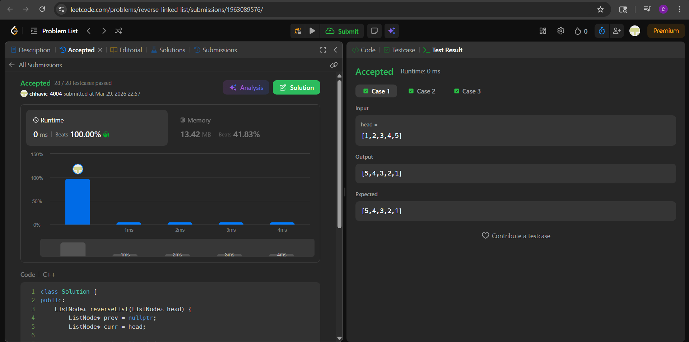

# 206. Reverse Linked List

**Author:** Chhavi  
**Platform:** LeetCode  
**Difficulty:** Easy  
**Language:** C++

---

## Problem

Given the `head` of a singly linked list, reverse the list and return the reversed list.

---

## My Approach

I used the **iterative 3-pointer approach** to reverse the linked list in-place without any extra space. The idea is:

1. Maintain three pointers — `prev`, `curr`, and `next`.
2. At each step, save `curr->next` in `next`, then flip `curr->next` to point to `prev`.
3. Move `prev` and `curr` one step forward.
4. Repeat until `curr` is `null`. Return `prev` as the new head.

This works because at every iteration we are reversing one link, and by the time `curr` reaches `null`, all links have been flipped.

---

## Code

```cpp
class Solution {
public:
    ListNode* reverseList(ListNode* head) {
        ListNode* prev = nullptr;
        ListNode* curr = head;

        while (curr != nullptr) {
            ListNode* next = curr->next;
            curr->next = prev;
            prev = curr;
            curr = next;
        }

        return prev;
    }
};
```

---

## Complexity

| | |
|---|---|
| **Time** | O(n) |
| **Space** | O(1) |

---

