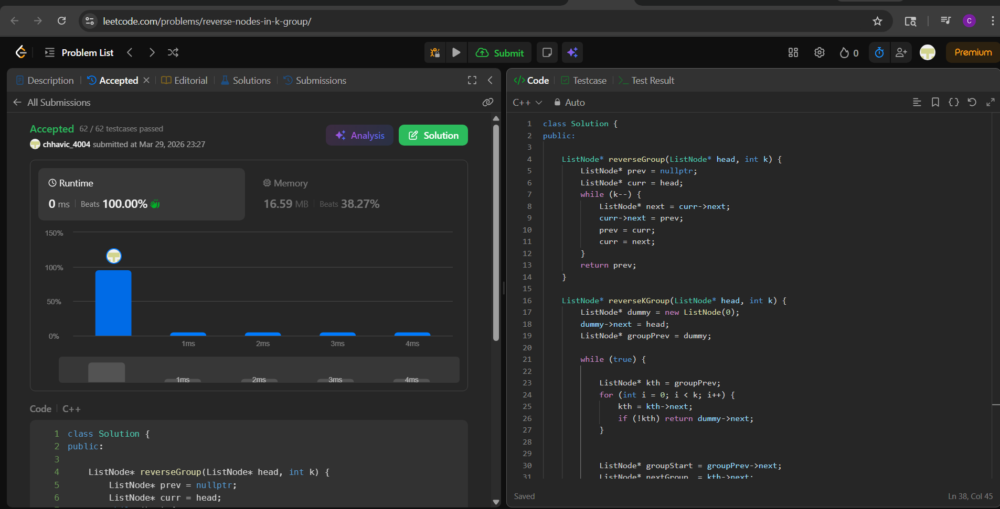

# 25. Reverse Nodes in k-Group

**Author:** Chhavi  
**Platform:** LeetCode  
**Difficulty:** Hard  
**Language:** C++

---

## Problem

Given the `head` of a linked list, reverse the nodes of the list `k` at a time, and return the modified list.

`k` is a positive integer and is less than or equal to the length of the linked list. If the number of nodes is not a multiple of `k` then the left-out nodes at the end should remain as they are.

You may not alter the values in the list's nodes, only the nodes themselves may be changed.

---

## My Approach

I used a fully **iterative approach** with a dummy node to solve this in O(1) extra space (no recursion stack). The idea is:

1. Use a `dummy` node before `head` to simplify edge cases.
2. Track `groupPrev` — the node just before the current group.
3. For each group of `k` nodes:
   - **Check** if `k` nodes exist ahead using a `kth` pointer — if not, stop.
   - **Save** `groupStart` (first node of group) and `nextGroup` (node after group).
   - **Reverse** exactly `k` nodes using a helper function.
   - **Reconnect** — link `groupPrev` to the new head (`kth`) and the new tail (`groupStart`) to `nextGroup`.
   - **Advance** `groupPrev` to `groupStart` (now the tail) for the next iteration.

The key insight: after reversing, `groupStart` becomes the **tail** of the reversed group, so it's the perfect anchor point to connect to the next group.

---

## Code

```cpp
class Solution {
public:
    // Helper: reverses k nodes starting from head, returns new head
    ListNode* reverseGroup(ListNode* head, int k) {
        ListNode* prev = nullptr;
        ListNode* curr = head;
        while (k--) {
            ListNode* next = curr->next;
            curr->next = prev;
            prev = curr;
            curr = next;
        }
        return prev; // new head of reversed group
    }

    ListNode* reverseKGroup(ListNode* head, int k) {
        ListNode* dummy = new ListNode(0);
        dummy->next = head;
        ListNode* groupPrev = dummy;

        while (true) {
            // Step 1: Check if k nodes exist from groupPrev
            ListNode* kth = groupPrev;
            for (int i = 0; i < k; i++) {
                kth = kth->next;
                if (!kth) return dummy->next; // fewer than k nodes left
            }

            // Step 2: Save pointers before reversing
            ListNode* groupStart = groupPrev->next;
            ListNode* nextGroup  = kth->next;

            // Step 3: Reverse k nodes
            reverseGroup(groupStart, k);

            // Step 4: Reconnect
            groupPrev->next  = kth;       // connect prev group to new head
            groupStart->next = nextGroup; // connect tail to next group

            // Step 5: Move groupPrev to tail of current group
            groupPrev = groupStart;
        }
    }
};
```

---

## Complexity


**Time** :O(n) 
**Space**:O(1) 

Each node is touched exactly twice — once to check if k nodes exist, once to reverse.


