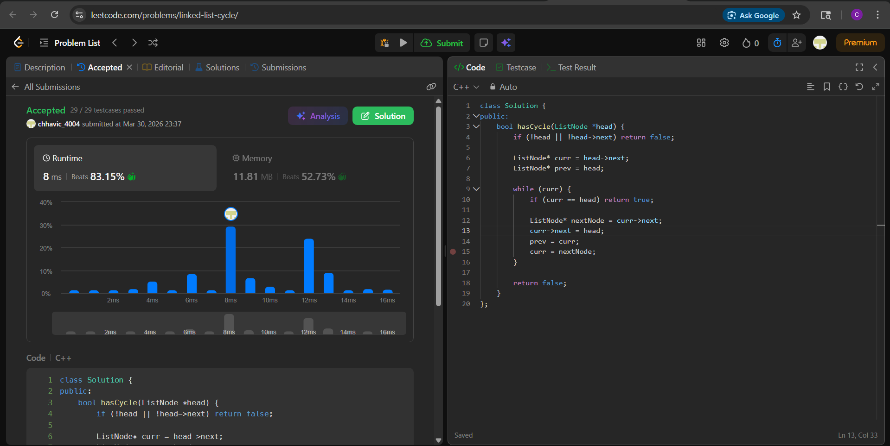

# 141. Linked List Cycle

**Author:** Chhavi  
**Platform:** LeetCode  
**Difficulty:** Easy  
**Language:** C++

---

## Problem

Given `head`, the head of a linked list, determine if the linked list has a cycle in it.

There is a cycle in a linked list if there is some node in the list that can be reached again by continuously following the `next` pointer. Return `true` if there is a cycle in the linked list. Otherwise, return `false`.

---

## My Approach

I used the **sentinel redirection approach** to detect a cycle in O(1) space without Floyd's algorithm.

The idea is to use `head` itself as a sentinel marker. As I traverse the list, I redirect each visited node's `next` pointer back to `head`. If I ever encounter a node whose address is `head` during traversal, it means I've looped back to an already-visited node — confirming a cycle.

1. Start from `head->next` as `curr`, keep `prev` at `head`.
2. At each step, check if `curr == head`. If yes, cycle detected — return `true`.
3. Otherwise, save `curr->next` in `nextNode`, redirect `curr->next` to `head` (marking it as visited), then advance.
4. If `curr` becomes `null`, we exited the list normally — return `false`.

This works because in a cyclic list, the traversal must eventually reach a node we already redirected to `head`, and that node's next will lead us back to `head`.

---

## Code

class Solution {
public:
    bool hasCycle(ListNode *head) {
        if (!head || !head->next) return false;

        ListNode* curr = head->next;
        ListNode* prev = head;

        while (curr) {
            if (curr == head) return true;

            ListNode* nextNode = curr->next;
            curr->next = head;
            prev = curr;
            curr = nextNode;
        }

        return false;
    }
};

---

## Complexity

 **Time**  O(n)
**Space**  O(1) 

---

