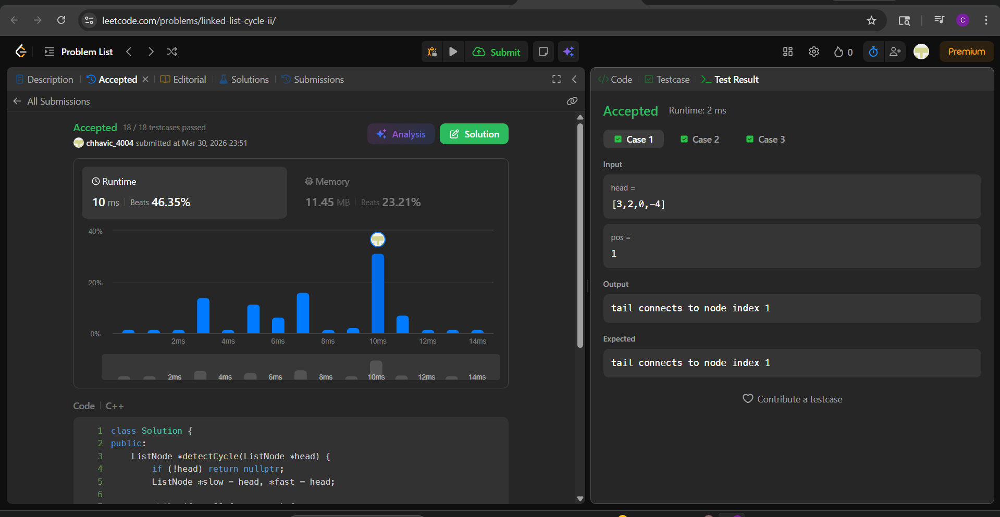

-# 142. Linked List Cycle II

**Author:** Chhavi  
**Platform:** LeetCode  
**Difficulty:** Medium  
**Language:** C++

---

## Problem

Given the `head` of a linked list, return the node where the cycle begins. If there is no cycle, return `null`.

There is a cycle in a linked list if there is some node in the list that can be reached again by continuously following the `next` pointer. The position `pos` (0-indexed) denotes the index of the node that the tail's `next` pointer connects to. `pos` is not passed as a parameter.

Do not modify the linked list.

---

## My Approach

I used **Floyd's Cycle Detection Algorithm** (Tortoise and Hare) in two phases.

**Phase 1 — Detect if a cycle exists:**
- Use two pointers, `slow` and `fast`, both starting at `head`.
- Move `slow` by one step and `fast` by two steps each iteration.
- If they meet, a cycle exists. Break out of the loop.
- If `fast` or `fast->next` becomes `null`, there is no cycle — return `nullptr`.

**Phase 2 — Find the cycle entry node:**
- Reset `slow` back to `head`, keep `fast` at the meeting point.
- Move both one step at a time.
- The node where they meet is the start of the cycle.

**Why does Phase 2 work?**  
Let `F` = distance from head to cycle entry, `a` = distance from entry to meeting point, `L` = cycle length.  
At the meeting point: Fast travels `2(F + a)` and slow travels `F + a`, with fast having done extra loops: `F + a + nL = 2(F + a)` → **`F = nL - a`**.  
This means the distance from head to entry equals the remaining distance from the meeting point to entry — so both pointers arrive at the entry node simultaneously.

---

## Code

class Solution {
public:
    ListNode *detectCycle(ListNode *head) {
        if (!head) return nullptr;
        ListNode *slow = head, *fast = head;

        while (fast && fast->next) {
            slow = slow->next;
            fast = fast->next->next;
            if (slow == fast) break;
        }

        if (!fast || !fast->next) return nullptr;

        slow = head;
        while (slow != fast) {
            slow = slow->next;
            fast = fast->next;
        }
        return slow;
    }
};

---

## Dry Run

**Input:** `[3 → 2 → 0 → -4 → back to 2]`

**Phase 1 — Find meeting point:**

| Step | slow | fast |
|------|------|------|
| Start | 3 | 3 |
| 1 | 2 | 0 |
| 2 | 0 | 2 |
| 3 | -4 | -4 ← meet |

**Phase 2 — Find cycle entry:**

| Step | slow | fast |
|------|------|------|
| Start | 3 (head) | -4 (meeting point) |
| 1 | 2 | 2 ← meet = entry ✅ |

**Output:** Node with value `2`

---

## Complexity

 **Time** `O(n)` 
**Space**  `O(1)` 

---

